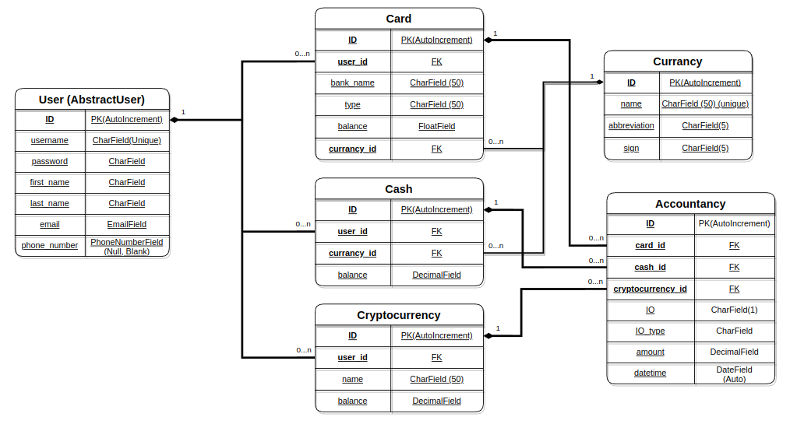

<p align="center">
    
</p>

# ZLATNIC

**ZLATNIC** is a platform to control personal expenses.

## 🌐 Live Demo

[🔗 Deployed on Render](https://zlatnic.onrender.com/)

**Credentials for demo access:**

```
Username: user
Password: user12345
```

## 📊 Database Structure

The project is built on a database with the following structure:


## 🛠️ Prerequisites

To successfully run the setup script below, your system must meet the following requirements:

- Linux OS (tested on Debian-based distributions)
- Python 3.9 or higher
- `curl` CLI installed

## 🚀 Project Setup (Linux)

Clone the repository and configure environment variables:

```bash
git clone https://github.com/AKrekhovetskyi/zlatnic.git
cd zlatnic
cp .env.sample .env
```

- Open the "[.env](./.env)" file and fill in the required environment variables.
- Run the build script:

```bash
./build.sh
```

- Before running the project locally, let `uv` know which ".env" file to use by exporting the [`UV_ENV_FILE`](https://docs.astral.sh/uv/reference/environment/#uv_env_file) environment variable:

```bash
export UV_ENV_FILE=.env
```

- Install the required dependencies:

```bash
uv sync --group test
```

- Run the server:

```bash
uv run manage.py runserver
```

### 📌 Optionally

Enable "[Shell autocompletion](https://docs.astral.sh/uv/getting-started/installation/#shell-autocompletion)" for an enhanced CLI experience.

## ✨ Features

- User authentication: registration, login, logout, profile updates, and profile picture management
- Management of various wallet types (cards, cash, cryptocurrency)
- Income funding panel with multiple source options
- Panels with expense categories
- Financial turnover summary for the current month
- Detailed financial transaction history for each wallet
- Pagination of accountancy page
- Search functionality for transactions by income/outcome type within a wallet
- Powerful admin panel for advanced managing
- Fully responsive web design for seamless usage on desktop and mobile devices
